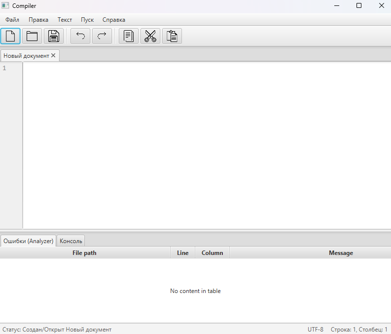

# 1. Название и цель лабораторной работы
**Название:** Лабораторная работа 1. Разработка пользовательского интерфейса (GUI) для языкового процессора.  
**Цель работы:** Создание кроссплатформенного графического интерфейса (GUI) для языкового процессора в виде специализированного текстового редактора. В дальнейшем данный редактор будет дополнен функциями языкового процессора (лексическим, синтаксическим анализаторами и т.д.).

# 2. Сведения об авторе
* **Студент:** Попов Виктор Андреевич
* **Группа:** АВТ-314
* **Учебное заведение:** НГТУ

# 3. Описание проекта
Данный проект представляет собой графический интерфейс (GUI) разрабатываемого компилятора. Приложение реализует полноценный многовкладочный текстовый редактор кода с поддержкой горячих клавиш, масштабирования текста, нумерации строк и динамической строки состояния. В нижней части окна предусмотрена панель вывода результатов анализа (таблица ошибок и консоль), подготавливающая архитектуру для будущих этапов разработки языкового процессора.

# 4. Используемые технологии
* **Язык программирования:** Java 21
* **Фреймворк для GUI:** JavaFX 21 (FXML + SceneBuilder для визуальной верстки)
* **Система сборки:** Maven
* **Среда разработки (IDE):** IntelliJ IDEA

# 5. Инструкция по сборке и запуску

### 1. Шаги для установки зависимостей
Для работы приложения необходим установленный JDK версии не ниже 21 и система сборки Maven.
1. Склонируйте репозиторий с проектом или распакуйте архив в удобную директорию.
2. Откройте проект в IntelliJ IDEA.
3. Среда разработки автоматически подтянет все необходимые зависимости (JavaFX) из файла `pom.xml`. Если этого не произошло, нажмите кнопку `Reload All Maven Projects` в панели Maven (справа).

### 2. Команды для сборки и запуска проекта
Откройте терминал в корневой папке проекта и выполните команду для очистки и компиляции проекта:
```bash
mvn clean compile
```

Для запуска приложения через Maven используйте команду:
```bash
mvn javafx:run
```

### 3. Путь к готовому исполняемому файлу
* **Точка входа (главный класс):** `src/main/java/org/veteroch4k/laba1/HelloApplication.java`.
* **Скомпилированные классы** располагаются в директории `target/classes/`.

# 6. Описание интерфейса и функций (Руководство пользователя)

  
*Рисунок 1 — Главное окно приложения*

Интерфейс приложения разделен на 4 основные области:
1. **Главное меню** (верхняя панель).
2. **Панель инструментов** (с графическими иконками быстрого доступа).
3. **Область редактирования** (с поддержкой вкладок и нумерацией строк).
4. **Область вывода результатов** (нижняя панель с вкладками "Ошибки" и "Консоль").

### Базовый функционал и горячие клавиши:

* **Управление файлами (Меню "Файл" / Панель инструментов):**
    * `Создать` (**Ctrl+N** / Иконка чистого листа) — Открывает новую пустую вкладку редактора.
    * `Открыть` (**Ctrl+O** / Иконка папки) — Вызывает системное диалоговое окно для открытия текстового файла. Открытый файл появляется в новой вкладке.
    * `Сохранить` (**Ctrl+S** / Иконка дискеты) — Сохраняет изменения в текущем активном файле.
    * `Сохранить как` (**Ctrl+Shift+S**) — Сохраняет текущую вкладку в новый файл на диске.
    * `Выход` (**Ctrl+Q**) — Завершает работу программы. При попытке закрытия (через меню или "крестик" окна) выводится диалоговое окно с подтверждением выхода для защиты от случайной потери данных.

* **Правка текста (Меню "Правка" / Панель инструментов):**
    * `Отменить` (**Ctrl+Z**) / `Повторить` (**Ctrl+Y**) — Управление историей изменений активной вкладки.
    * `Вырезать` (**Ctrl+X**), `Копировать` (**Ctrl+C**), `Вставить` (**Ctrl+V**), `Удалить` (**Delete**), `Выделить все` (**Ctrl+A**) — Стандартные операции работы с буфером обмена.

### Дополнительные возможности:

1. **Многовкладочный интерфейс:** Поддерживается одновременная работа с несколькими файлами. Каждая вкладка хранит свой независимый текст и привязку к файлу на диске.
2. **Нумерация строк:** Слева от поля ввода кода автоматически генерируется колонка с номерами строк, прокрутка которой строго синхронизирована с основным текстом.
3. **Drag-and-Drop:** Приложение поддерживает открытие файлов путем их перетаскивания мышкой из файлового менеджера ОС прямо в область вкладок.
4. **Масштабирование текста:** Изменение размера шрифта (увеличение/уменьшение) в активной вкладке осуществляется путем зажатия клавиши **Ctrl** и прокрутки **колесика мыши**.
5. **Динамическая строка состояния:** Расположена в самом низу окна. Отображает текущий статус программы и текущую позицию курсора (строка и столбец).

# 7. Ограничения и особенности реализации
* **Подсветка синтаксиса:** На текущем этапе разработки не реализована в связи с ограничениями стандартного компонента `TextArea` в JavaFX.
* **Нумерация строк:** Выполнена базовым методом путем синхронизации двух текстовых полей внутри контейнера `HBox`.
* **Заглушки интерфейса:** Пункты меню "Текст", "Пуск" и "Справка" в данный момент не имеют привязанной логики и зарезервированы для будущих лабораторных работ (реализация лексического/синтаксического анализатора). Аналогично, таблица в окне "Ошибки (Analyzer)" подготовлена, но ожидает подключения логики компилятора.