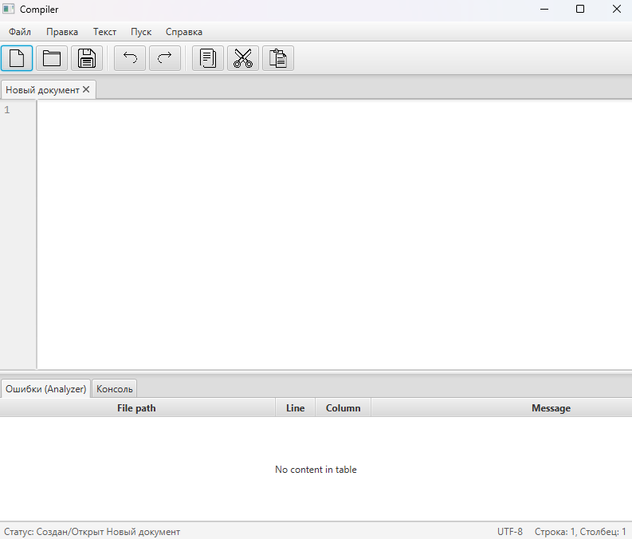

# 1. Название и цель лабораторной работы
**Название:** Лабораторная работа 2. Разработка лексического анализатора (сканера) и его интеграция в GUI языкового процессора.  
**Цель работы:** Программная реализация сканера для выделения лексем из входного текста в соответствии с заданным вариантом и его интеграция в ранее разработанный кроссплатформенный текстовый редактор (GUI).

# 2. Сведения об авторе
* **Студент:** Попов Виктор Андреевич
* **Группа:** АВТ-314
* **Учебное заведение:** НГТУ

# 3. Постановка задачи и описание проекта
Данный проект представляет собой графический интерфейс (GUI) разрабатываемого компилятора, объединенный с модулем лексического анализа.
Приложение реализует полноценный многовкладочный текстовый редактор кода (подготовка из Лабораторной работы 1) и конечный автомат (FSM), который разбивает введенный код на токены (лексемы) и отлавливает лексические ошибки.

**Общие требования к сканеру:**
* Вынесение логики анализа в отдельный модуль.
* Поддержка многострочности (корректный подсчет строк и столбцов при переносах).
* Вывод результатов в графический интерфейс (таблица лексем и таблица ошибок).
* Навигация по коду при клике на найденную лексему/ошибку.

# 4. Вариант задания
**Описание:** Прототип функции на языке PHP.
**Примеры корректных входных строк:**
1. `public function calcTax(int $amount, ?string $currency = 'USD'): float;`
2. `function printMessage(string $msg) {}`

**Перечень допустимых лексем:**
* Ключевые слова и типы (`function`, `public`, `int`, `string`, `float`, `bool` и т.д. — коды 1-23)
* Идентификаторы (имена функций — код 24)
* Спецсимволы и пунктуация (`(`, `)`, `,`, `:`, `?`, `|`, `\`, `[`, `]`, `&` — коды 25-35, 41)
* Переменные PHP (начинаются со знака `$`, код 36)
* Строковые литералы (в одинарных `'` и двойных `"` кавычках — коды 37, 38)
* Числа (целые и дробные с точкой — коды 39, 40)

# 5. Диаграмма состояний (Теоретическая модель FSM)

  
*Рисунок 1 — Конечный автомат лексического анализатора*

**Краткое описание работы автомата:**
* **START (0):** Начальное состояние. Читает текущий символ и определяет ветку логики. Игнорирует пробелы, символы табуляции и переносы строк (с увеличением счетчика).
* **Сборка слов (1):** При чтении буквы уходит в цикл сбора букв и цифр. По завершении сверяет слово со словарем (коды 1-23). Если совпадений нет — выдает идентификатор (код 24).
* **Одиночные символы (2-11, 21):** Прямые переходы для пунктуации и операторов прототипа функции. Возвращают соответствующие коды сразу после прочтения.
* **Переменные (12-13):** Переход по символу `$`, после чего собираются буквы, цифры и подчеркивания (код 36).
* **Строки и числа (14-20):** Обработка кавычек с циклом до закрывающего символа (коды 37, 38) и цифр, включая дробные числа с плавающей точкой (коды 39, 40). Поддерживается многострочность внутри строковых литералов.
* **ERROR:** Фиксируется, если встречен недопустимый символ.

# 6. Используемые технологии
* **Язык программирования:** Java 21
* **Фреймворк для GUI:** JavaFX 21 (FXML + SceneBuilder)
* **Система сборки:** Maven
* **Среда разработки (IDE):** IntelliJ IDEA

# 7. Инструкция по сборке и запуску
Для работы приложения необходим установленный JDK версии не ниже 21 и система сборки Maven.
1. Склонируйте репозиторий с проектом в удобную директорию и откройте в IntelliJ IDEA.
2. Среда разработки автоматически подтянет зависимости из `pom.xml`.
3. Откройте терминал в корневой папке проекта и выполните команду для очистки и компиляции:
   ```bash
   mvn clean compile
   ```
4. Для запуска приложения используйте команду:
   ```bash
   mvn javafx:run
   ```
*Главный класс располагается по пути: `src/main/java/org/veteroch4k/laba1/HelloApplication.java`.*

# 8. Описание интерфейса и функций (Руководство пользователя)

  
*Рисунок 2 — Главное окно приложения*

**Работа с текстом и файлами:**
* Поддерживается многовкладочный интерфейс с одновременным открытием нескольких файлов.
* Создание (**Ctrl+N**), Открытие (**Ctrl+O**), Сохранение (**Ctrl+S**).
* Поддержка **Drag-and-Drop** для файлов из ОС.
* Автоматическая нумерация строк и масштабирование текста (**Ctrl + Колесико мыши**).
* Динамическая строка состояния с позицией курсора.

**Лексический анализ:**
* Запуск сканера осуществляется кнопкой **"Пуск"** на панели инструментов или клавишей **F5**.
* В нижней панели расположены две таблицы:
   * **Таблица "Лексемы":** Содержит корректно распознанные элементы (тип, значение, строка, столбец).
   * **Таблица "Ошибки (Analyzer)":** Выводит нераспознанные символы и незакрытые строки.
* **Интерактивная навигация:** При клике на любую строку в таблицах лексем или ошибок курсор в верхнем редакторе автоматически переходит к проблемному символу и выделяет его.

# 9. Тестовые примеры

### 1. Корректная строка
**Код:** `function myFunc(int $a);`

| Тип лексемы | Значение | Строка | Символ |
| :--- | :--- | :--- | :--- |
| KW_FUNCTION | function | 1 | 1 |
| IDENTIFIER | myFunc | 1 | 10 |
| L_PAREN | ( | 1 | 16 |
| TYPE_INT | int | 1 | 17 |
| VARIABLE | $a | 1 | 21 |
| R_PAREN | ) | 1 | 23 |
| SEMICOLON | ; | 1 | 24 |

### 2. Строка с недопустимым символом
**Код:** `function calc() @;`

**Вкладка "Лексемы":**
| Тип лексемы | Значение | Строка | Символ |
| :--- | :--- | :--- | :--- |
| KW_FUNCTION | function | 1 | 1 |
| IDENTIFIER | calc | 1 | 10 |
| L_PAREN | ( | 1 | 14 |
| R_PAREN | ) | 1 | 15 |
| SEMICOLON | ; | 1 | 18 |

**Вкладка "Ошибки":**
| File path | Line | Column | Message |
| :--- | :--- | :--- | :--- |
| Новый документ | 1 | 17 | Недопустимый символ: '@' |

### 3. Многострочный пример
**Код:**
```php
function test(
  string $b
);
```

**Вкладка "Лексемы":**
| Тип лексемы | Значение | Строка | Символ |
| :--- | :--- | :--- | :--- |
| KW_FUNCTION | function | 1 | 1 |
| IDENTIFIER | test | 1 | 10 |
| L_PAREN | ( | 1 | 14 |
| TYPE_STRING | string | 2 | 3 |
| VARIABLE | $b | 2 | 10 |
| R_PAREN | ) | 3 | 1 |
| SEMICOLON | ; | 3 | 2 |