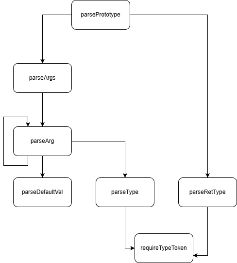
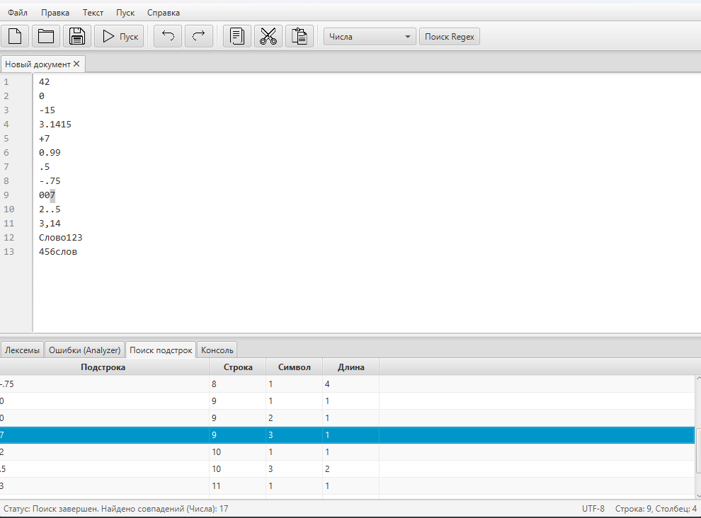
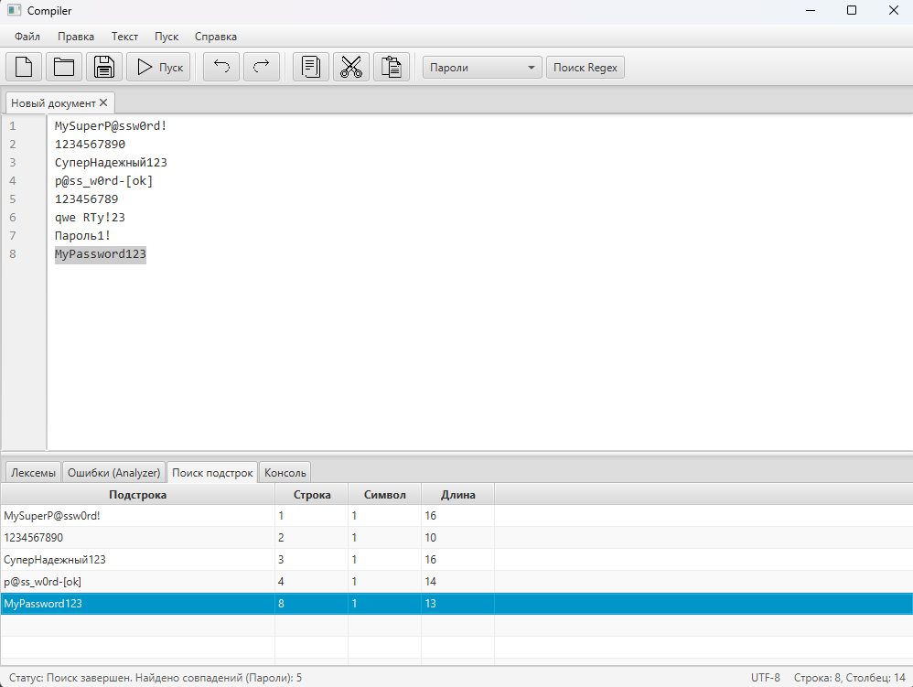
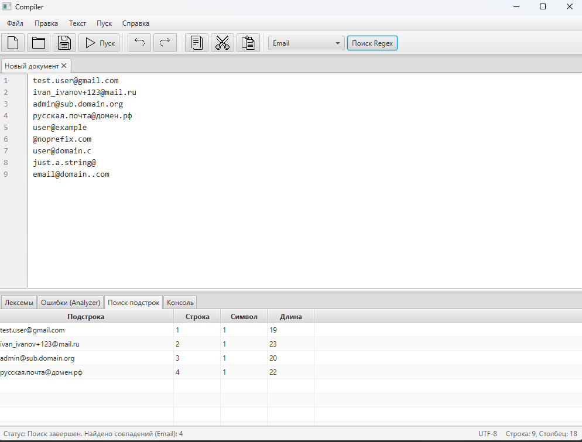
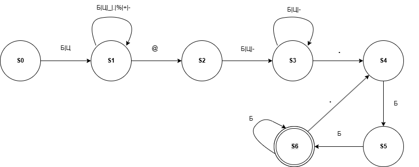
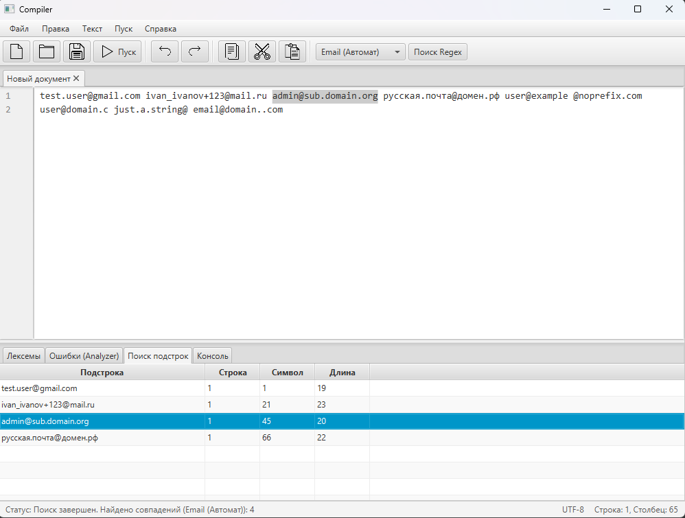

# 1. Название и цель лабораторной работы
**Название:** Лабораторная работа 3. Разработка синтаксического анализатора (парсера).  
**Цель работы:** Изучить назначение и принципы работы синтаксического анализатора в структуре компилятора. Спроектировать грамматику, построить соответствующую схему метода анализа грамматики и выполнить программную реализацию парсера с нейтрализацией синтаксических ошибок методом Айронса. Интегрировать разработанный модуль в ранее созданный графический интерфейс языкового процессора.

# 2. Сведения об авторе
* **Студент:** Попов Виктор Андреевич
* **Группа:** АВТ-314
* **Учебное заведение:** НГТУ

# 3. Постановка задачи и описание проекта
Данный проект представляет собой графический интерфейс (GUI) разрабатываемого компилятора, включающий модули лексического и синтаксического анализа.

**Общие требования к парсеру:**
* Разработать грамматику для заданной синтаксической конструкции.
* Построить схему метода анализа на основе разработанной грамматики.
* Выполнить программную реализацию алгоритма работы синтаксического анализа.
* Реализовать алгоритм нейтрализации синтаксических ошибок методом Айронса.
* Входные данные — строка (текст программного кода) из области редактирования.

# 4. Вариант задания
**Описание:** Прототип функции на языке PHP.
**Примеры корректных входных строк:**
1. `function calcTax(int $amount, string $currency = 'USD'): float;`
2. `function printMessage(string $msg) {}`

**Перечень допустимых лексем:**
* Ключевые слова и типы (`function`, `int`, `string`, `float` и т.д.)
* Идентификаторы (имена функций)
* Спецсимволы и пунктуация (`(`, `)`, `,`, `:`, `?`, `=`, `;`)
* Переменные PHP (начинаются со знака `$`)
* Строковые литералы и числа

# 5. Лексический анализатор (FSM)

  
*Рисунок 1 — Конечный автомат лексического анализатора*

Модуль лексического анализатора считывает исходный текст посимвольно, отсеивает пробелы и формирует поток токенов (лексем) для передачи в синтаксический анализатор. При встрече недопустимого символа генерируется лексическая ошибка.

# 6. Синтаксический анализатор (Парсер)

### 6.1 Разработка грамматики G[Prototype]
Грамматика описывает правила построения прототипа функции в PHP:

1. `<Prototype> → 'function' <Identifier> '(' <Args> ')' <RetType> ';'`
2. `<Args> → <Arg> <ArgsTail> | ε`
3. `<ArgsTail> → ',' <Arg> <ArgsTail> | ε`
4. `<Arg> → <Type> '$' <Identifier> <DefaultVal>`
5. `<Type> → '?' <TypeName> | <TypeName>`
6. `<DefaultVal> → '=' <Literal> | ε`
7. `<RetType> → ':' <Type> | ε`

* `<Literal> → <Number> | <Float> | <String>`
* `<Identifier> → <Letter> <IdRem>`
* `<IdRem> → <Letter> <IdRem> | <Digit> <IdRem> | '_' <IdRem> | ε`
* `<TypeName> → 'int' | 'float' | 'string' | <Identifier>`
* `<Number> → <Digit> <NumberTail>`
* `<NumberTail> → <Digit> <NumberTail> | ε`
* `<Float> → <Number> '.' <Number>`
* `<String> → '"' <StringChars> '"' | '\'' <StringChars> '\''`

* `<Digit> -> '0' | '1' | '2' | '3' | '4' | '5' | '6' | '7' | '8' | '9'`
* `<Letter> -> 'a' | 'b' | ... | 'z' | 'A' | 'B' | ... | 'Z'`
* `<StringChars> -> любая последовательность символов, кроме кавычек`

Следуя введенному формальному определению грамматики, представим G[‹Prototype›] ее составляющими:

**Z** = ‹Prototype›

**VT** =  
`{ (, ), ;, ,, $, ?, =, :, ., ", ', _, , a..z, A..Z, 0..9 }`

**VN** =  
`{ <Prototype>, <Args>, <ArgsTail>, <Arg>, <Type>, <DefaultVal>, <Literal>, <RetType>, <Identifier>, <IdRem>, <TypeName>, <Number>, <NumberTail>, <Float>, <String>, <StringChars>, <Digit>, <Letter> }`


### 6.2 Классификация грамматики
По иерархии Хомского данная грамматика является **контекстно-свободной (КС-грамматикой)**.
Она относится к классу **LL(1)**, так как леворекурсивны правила отсутствуют, однозначны, и для выбора альтернативы при разборе парсеру достаточно предпросмотра одного следующего токена.

### 6.3 Метод анализа
Используется алгоритм **рекурсивного спуска**. Для каждого нетерминала грамматики реализован отдельный метод (например, `parsePrototype()`, `parseArgs()`, `parseType()`). Парсер последовательно вызывает эти методы, "поглощая" ожидаемые токены из списка, переданного сканером.

**Схема рекурсивного спуска:**
Ниже представлена схема графа вызовов парсера при выполнении синтаксического анализа:

  
*Рисунок 2 — Схема метода рекурсивного спуска*

### 6.4 Диагностика и нейтрализация ошибок (Метод Айронса)
Для предотвращения остановки анализатора при первой же ошибке реализована нейтрализация на уровне фразы (упрощенный метод Айронса).
**Алгоритм нейтрализации:**
1. Если встречен неожиданный токен, фиксируется сообщение об ошибке с указанием позиции.
2. Анализатор "пропускает" ошибочные токены, пока не встретит ожидаемый токен или один из **синхронизирующих символов** (например, скобки `(`, `)` или точку с запятой `;`), с учетом FOLLOW-множеств для предотвращения каскадного обрушения.
3. Это предотвращает появление ложных ошибок и позволяет продолжить анализ оставшейся части строки.


# 7. Регулярные выражения

### 7.1 Построить РВ, описывающее целые числа и числа с плавающей точкой (разделитель точка). (20)
Регулярное выражение:
* ^[+-]?((0|[1-9][0-9]*)(\.[0-9]+)?|\.[0-9]+)$
1. [+-]? -> либо +, либо - (причем необязательные из-за знака '?')
2. (0|[1-9][0-9]*) -> либо 0, либо цифра от 1-9, а затем цифра от 0-9 (причем * означает необязательное повторение) 
3. (\.[0-9]+)? -> необязательная дробная часть ('?'), цифры от 0-9 (причем хотя бы одна цифра должна быть '+')
4. |\.[0-9]+ -> либо же (вместо 2 и 3) просто дробная часть

Примеры:

**Строки:** 
`42
0
-15
3.1415
+7
0.99
.5
-.75
007
2..5
3,14
Слово123
456слов`
* **Результат:** Будут обнаружены все числа (кроме 2..5) -> прочитаются 2 и .5



### 7.2 Построить РВ, описывающее пароль (набор строчных и прописных латинских и русских букв, цифр и символов, длиной хотя бы 10 символов). (20)
Регулярное выражение:
* ^[A-Za-zА-Яа-я0-9!@#$%^&*()_+\-=\[\]{};':"\\|,.<>\/?]{10,}$
1. A-Za-zА-Яа-я0-9 -> допустимые символы (русские и латинские буквы, а также цифры 0-9)
2. !@#$%^&*()_+\-=\[\]{};':"\\|,.<>\/? -> допустимые символы
3. {10,} -> длина 10 символов и более

Примеры:

**Строки:**
`MySuperP@ssw0rd!
1234567890
СуперНадежный123
p@ss_w0rd-[ok]
123456789
qwe RTy!23
Пароль1!
MyPassword123`
* **Результат:** Будут обнаружены только первые 4 и последний пароли



### 7.3 Построить РВ, описывающее формат адреса электронной почты. (1)
Регулярное выражение:
* ^[a-zA-Z0-9а-яА-Я][a-zA-Z0-9а-яА-Я._%+-]*@[a-zA-Z0-9а-яА-Я-]+(?:\.[a-zA-Zа-яА-Я]{2,})+$
1. [a-zA-Z0-9а-яА-Я._%+-] -> допустимые символы 
2. (?:\.[a-zA-Zа-яА-Я]{2,})+ -> финальный фрагмент (обязателен)
3. {2,} -> длина 2 символа и более

Примеры:

**Строки:**
`test.user@gmail.com
ivan_ivanov+123@mail.ru
admin@sub.domain.org
русская.почта@домен.рф
user@example
@noprefix.com
user@domain.c
just.a.string@
email@domain..com`
* **Результат:** Будут обнаружены только первые 4 домена


### 7.4 граф автомата для регулярного выражения 7.3



# 8. Используемые технологии
* **Язык программирования:** Java 21
* **Фреймворк для GUI:** JavaFX 21 (FXML + SceneBuilder)
* **Система сборки:** Maven

# 9. Инструкция по сборке и запуску
1. Откройте проект в IntelliJ IDEA и дождитесь загрузки зависимостей Maven.
2. Откройте терминал в корневой папке проекта и выполните команду:
   ```bash
   mvn clean compile
   ```
3. Для запуска приложения используйте команду:
   ```bash
   mvn javafx:run
   ```
   
# 10. Тестовые примеры

### 1. Корректная строка (Успешный анализ)
**Код:** `function myFunc(int $a);`
* **Результат:** Таблица лексем заполняется 7 корректными токенами. Таблица ошибок пуста. Статус: `Анализ завершен успешно. Ошибок не найдено.`


### 2. Строка с лексической ошибкой
**Код:** `function calc() @;`
* **Описание:** Парсер игнорирует недопустимый символ `@`, отфильтрованный сканером, и успешно завершает синтаксический анализ остального кода.
* **Ошибка в таблице:** `Лексическая ошибка: Недопустимый символ. Встречено: '@'` (Строка 1, Символ 17).
  *(Для данного теста ниже приведено 2 скриншота: с отработкой лексем и выводом ошибки)*


### 3. Корректная строка со всеми необязательными элементами
**Код:** `function myFunc(int $amount, ?string $currency = 'USD'): float;`
* **Описание:** Проверка работы эпсилон-правил грамматики: парсинг nullable-типа (`?string`), значения по умолчанию (`= 'USD'`) и возвращаемого типа функции (`: float`). Ошибок не найдено.


### 4. Строка с синтаксической ошибкой (Отработка метода Айронса)
**Код:** `function 123($a ;`
* **Описание:** Вместо имени функции введено число `123`, а также пропущена закрывающая скобка `)`. Метод Айронса успешно изолировал число, не нарушив дальнейший разбор, а затем виртуально подставил пропущенную скобку перед точкой с запятой.
* **Ошибки в таблице:** 1. `Ожидалось имя функции. Встречено: '123'`
   2. `Ожидалась закрывающая скобка ')'. Встречено: ';'`


### 5. Ошибка возвращаемого типа (Граничный случай с эпсилон-правилом)
**Код:** `function getData(): ;`
* **Описание:** Программист поставил двоеточие для указания возвращаемого типа, но забыл написать сам тип данных. Так как двоеточие присутствует, парсер строго требует наличие типа данных и не может уйти в эпсилон-правило.
* **Ошибка в таблице:** `Синтаксическая ошибка: Ожидался тип данных (int, string и т.д.). Встречено: ';'`


### 6. Эпсилон-пропуск разделителя (Отсутствие двоеточия)
**Код:** `function test(int $a) float;`
* **Описание:** Демонстрация корректной логики LL(1) парсера. Пропущено двоеточие `:` перед типом `float`. Парсер применяет эпсилон-правило, решая, что тип опущен, и переходит к ожиданию точки с запятой `;`. Встретив `float` вместо `;`, парсер выдает обоснованную ошибку.
* **Ошибка в таблице:** `Ожидалась точка с запятой ';' в конце прототипа. Встречено: 'float'`


### 7. Синтаксическая «каша» (Защита от каскадного обрушения)
**Код:** `4324234f342unctfsdfion myFunc(int $amount): float;`
* **Описание:** Проверка работы FOLLOW-множеств при нейтрализации. Анализатор игнорирует число `4324234`, берет первый попавшийся идентификатор `f342unctfsdfion` как имя функции, а затем отбрасывает реальное имя `myFunc`, чтобы восстановить логику разбора на скобке `(`.
* **Ошибки в таблице:**
   1. `Ожидалось ключевое слово 'function'. Встречено: '4324234'`
   2. `Ожидалась открывающая скобка '('. Встречено: 'myFunc'`


# Приложение А. Руководство пользователя

### Меню текстового редактора

**Пункт "Файл"**
Реализован следующий функционал:
* Создание, открытие, сохранение (в т.ч. "Сохранить как") документа.
* Выход из приложения.


**Пункт "Правка"**
Реализован стандартный функционал редактирования:
* Отмена/повтор действий.
* Вырезать, копировать, вставить, удалить.
* Выделить всё содержимое.


**Пункт "Текст"**
Выводит справочную информацию по курсовой работе **"Прототип функции на языке PHP"**:
* Грамматика, классификация, метод анализа, тестовые примеры и листинг кода.


**Пункт "Пуск"**
Запуск совместной работы лексического и синтаксического анализаторов.


**Пункт "Справка"**
Вызов данного руководства и информации о программе.


### Панель инструментов
Дублирует основные функции меню для быстрого доступа:
* (а) Создать, (б) Открыть, (в) Сохранить, (г) Пуск, (д) Отмена, (е) Повтор, (ж) Копировать, (з) Вырезать, (и) Вставить.


### Дополнительные возможности
1. **Многовкладочность:** Работа с несколькими файлами одновременно.
2. **Drag-and-Drop:** Открытие файлов перетаскиванием в окно редактора.
3. **Нумерация строк:** Отображается слева в окне редактирования.


