# 1. Название и цель лабораторной работы
**Название:** Лабораторная работа 3. Разработка синтаксического анализатора (парсера).  
**Цель работы:** Изучить назначение и принципы работы синтаксического анализатора в структуре компилятора. Спроектировать грамматику, построить соответствующую схему метода анализа грамматики и выполнить программную реализацию парсера с нейтрализацией синтаксических ошибок методом Айронса. Интегрировать разработанный модуль в ранее созданный графический интерфейс языкового процессора.

# 2. Сведения об авторе
* **Студент:** Попов Виктор Андреевич
* **Группа:** АВТ-314
* **Учебное заведение:** НГТУ

# 3. Постановка задачи и описание проекта
Данный проект представляет собой графический интерфейс (GUI) разрабатываемого компилятора, включающий модули лексического и синтаксического анализа.

**Общие требования к парсеру:**
* Разработать грамматику для заданной синтаксической конструкции.
* Построить схему метода анализа на основе разработанной грамматики.
* Выполнить программную реализацию алгоритма работы синтаксического анализа.
* Реализовать алгоритм нейтрализации синтаксических ошибок методом Айронса.
* Входные данные — строка (текст программного кода) из области редактирования.

# 4. Вариант задания
**Описание:** Прототип функции на языке PHP.
**Примеры корректных входных строк:**
1. `function calcTax(int $amount, string $currency = 'USD'): float;`
2. `function printMessage(string $msg) {}`

**Перечень допустимых лексем:**
* Ключевые слова и типы (`function`, `int`, `string`, `float` и т.д.)
* Идентификаторы (имена функций)
* Спецсимволы и пунктуация (`(`, `)`, `,`, `:`, `?`, `=`, `;`)
* Переменные PHP (начинаются со знака `$`)
* Строковые литералы и числа

# 5. Лексический анализатор (FSM)

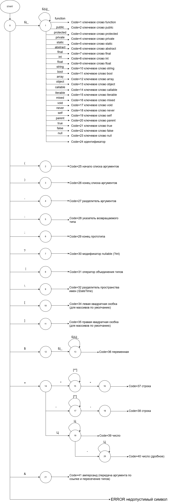  
*Рисунок 1 — Конечный автомат лексического анализатора*

Модуль лексического анализатора считывает исходный текст посимвольно, отсеивает пробелы и формирует поток токенов (лексем) для передачи в синтаксический анализатор. При встрече недопустимого символа генерируется лексическая ошибка.

# 6. Синтаксический анализатор (Парсер)

### 6.1 Разработка грамматики $G[Prototype]$
Грамматика описывает правила построения прототипа функции в PHP:

1. `<Prototype>  ::= KW_FUNCTION IDENTIFIER L_PAREN <Args> R_PAREN <RetType> SEMICOLON`
2. `<Args>       ::= <Arg> <ArgsTail> | ε`
3. `<ArgsTail>   ::= COMMA <Arg> <ArgsTail> | ε`
4. `<Arg>        ::= <Type> VARIABLE <DefaultVal>`
5. `<Type>       ::= QUESTION TYPE_NAME | TYPE_NAME | ε`
6. `<DefaultVal> ::= ASSIGN <Literal> | ε`
7. `<Literal>    ::= NUMBER | FLOAT | STRING`
8. `<RetType>    ::= COLON <Type> | ε`

*(где `ε` означает пустое правило / отсутствие элемента)*

### 6.2 Классификация грамматики
По иерархии Хомского данная грамматика является **контекстно-свободной (КС-грамматикой)**.
Она относится к классу **LL(1)**, так как правила леворекурсивны (отсутствуют), однозначны, и для выбора альтернативы при разборе парсеру достаточно предпросмотра одного следующего токена.

### 6.3 Метод анализа
Используется алгоритм **рекурсивного спуска**. Для каждого нетерминала грамматики реализован отдельный метод (например, `parsePrototype()`, `parseArgs()`, `parseType()`). Парсер последовательно вызывает эти методы, "поглощая" ожидаемые токены из списка, переданного сканером.

### 6.4 Диагностика и нейтрализация ошибок (Метод Айронса)
Для предотвращения остановки анализатора при первой же ошибке реализована нейтрализация на уровне фразы (упрощенный метод Айронса).
**Алгоритм нейтрализации:**
1. Если встречен неожиданный токен, фиксируется сообщение об ошибке с указанием позиции.
2. Анализатор "пропускает" ошибочные токены, пока не встретит ожидаемый токен или один из **синхронизирующих символов** (например, скобки `(`, `)` или точку с запятой `;`), с учетом FOLLOW-множеств для предотвращения каскадного обрушения.
3. Это предотвращает появление ложных ошибок и позволяет продолжить анализ оставшейся части строки.

# 7. Используемые технологии
* **Язык программирования:** Java 21
* **Фреймворк для GUI:** JavaFX 21 (FXML + SceneBuilder)
* **Система сборки:** Maven

# 8. Инструкция по сборке и запуску
1. Откройте проект в IntelliJ IDEA и дождитесь загрузки зависимостей Maven.
2. Откройте терминал в корневой папке проекта и выполните команду:
   ```bash
   mvn clean compile
   ```
3. Для запуска приложения используйте команду:
   ```bash
   mvn javafx:run
   ```
   
# 9. Тестовые примеры

### 1. Корректная строка (Успешный анализ)
**Код:** `function myFunc(int $a);`
* **Результат:** Таблица лексем заполняется 7 корректными токенами. Таблица ошибок пуста. Статус: `Анализ завершен успешно. Ошибок не найдено.`

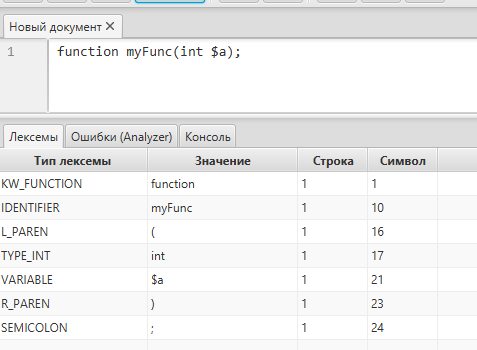

### 2. Строка с лексической ошибкой
**Код:** `function calc() @;`
* **Описание:** Парсер игнорирует недопустимый символ `@`, отфильтрованный сканером, и успешно завершает синтаксический анализ остального кода.
* **Ошибка в таблице:** `Лексическая ошибка: Недопустимый символ. Встречено: '@'` (Строка 1, Символ 17).
  *(Для данного теста ниже приведено 2 скриншота: с отработкой лексем и выводом ошибки)*

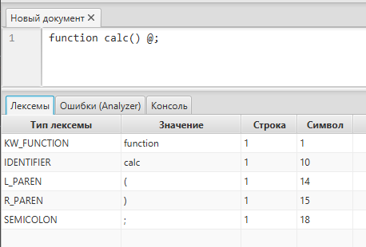
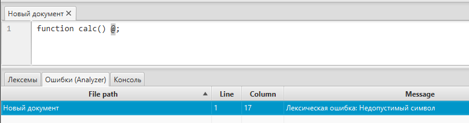

### 3. Корректная строка со всеми необязательными элементами
**Код:** `function myFunc(int $amount, ?string $currency = 'USD'): float;`
* **Описание:** Проверка работы эпсилон-правил грамматики: парсинг nullable-типа (`?string`), значения по умолчанию (`= 'USD'`) и возвращаемого типа функции (`: float`). Ошибок не найдено.

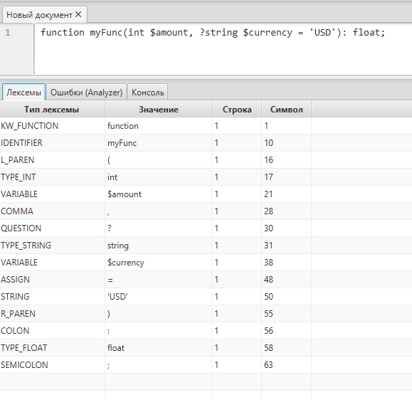

### 4. Строка с синтаксической ошибкой (Отработка метода Айронса)
**Код:** `function 123($a ;`
* **Описание:** Вместо имени функции введено число `123`, а также пропущена закрывающая скобка `)`. Метод Айронса успешно изолировал число, не нарушив дальнейший разбор, а затем виртуально подставил пропущенную скобку перед точкой с запятой.
* **Ошибки в таблице:** 1. `Ожидалось имя функции. Встречено: '123'`
   2. `Ожидалась закрывающая скобка ')'. Встречено: ';'`

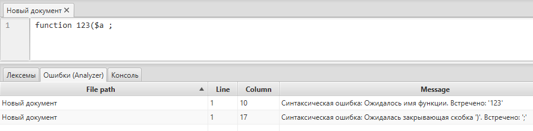

### 5. Ошибка возвращаемого типа (Граничный случай с эпсилон-правилом)
**Код:** `function getData(): ;`
* **Описание:** Программист поставил двоеточие для указания возвращаемого типа, но забыл написать сам тип данных. Так как двоеточие присутствует, парсер строго требует наличие типа данных и не может уйти в эпсилон-правило.
* **Ошибка в таблице:** `Синтаксическая ошибка: Ожидался тип данных (int, string и т.д.). Встречено: ';'`

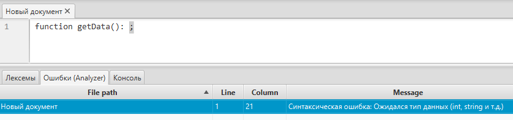

### 6. Эпсилон-пропуск разделителя (Отсутствие двоеточия)
**Код:** `function test(int $a) float;`
* **Описание:** Демонстрация корректной логики LL(1) парсера. Пропущено двоеточие `:` перед типом `float`. Парсер применяет эпсилон-правило, решая, что тип опущен, и переходит к ожиданию точки с запятой `;`. Встретив `float` вместо `;`, парсер выдает обоснованную ошибку.
* **Ошибка в таблице:** `Ожидалась точка с запятой ';' в конце прототипа. Встречено: 'float'`

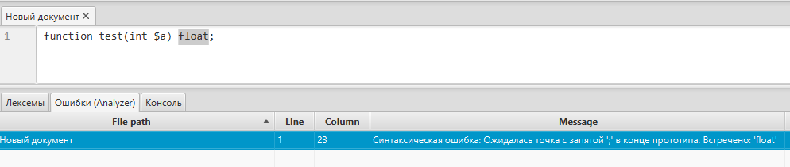

### 7. Синтаксическая «каша» (Защита от каскадного обрушения)
**Код:** `4324234f342unctfsdfion myFunc(int $amount): float;`
* **Описание:** Проверка работы FOLLOW-множеств при нейтрализации. Анализатор игнорирует число `4324234`, берет первый попавшийся идентификатор `f342unctfsdfion` как имя функции, а затем отбрасывает реальное имя `myFunc`, чтобы восстановить логику разбора на скобке `(`.
* **Ошибки в таблице:**
   1. `Ожидалось ключевое слово 'function'. Встречено: '4324234'`
   2. `Ожидалась открывающая скобка '('. Встречено: 'myFunc'`

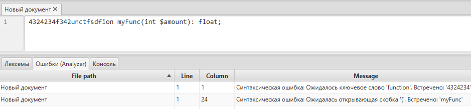

# Приложение А. Руководство пользователя

### Меню текстового редактора

**Пункт "Файл"**
Реализован следующий функционал:
* Создание, открытие, сохранение (в т.ч. "Сохранить как") документа.
* Выход из приложения.

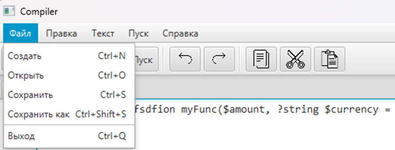

**Пункт "Правка"**
Реализован стандартный функционал редактирования:
* Отмена/повтор действий.
* Вырезать, копировать, вставить, удалить.
* Выделить всё содержимое.

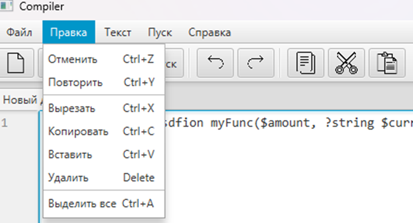

**Пункт "Текст"**
Выводит справочную информацию по курсовой работе **"Прототип функции на языке PHP"**:
* Грамматика, классификация, метод анализа, тестовые примеры и листинг кода.

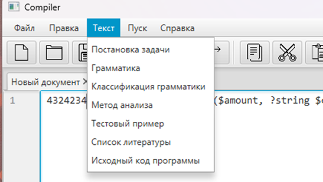

**Пункт "Пуск"**
Запуск совместной работы лексического и синтаксического анализаторов.

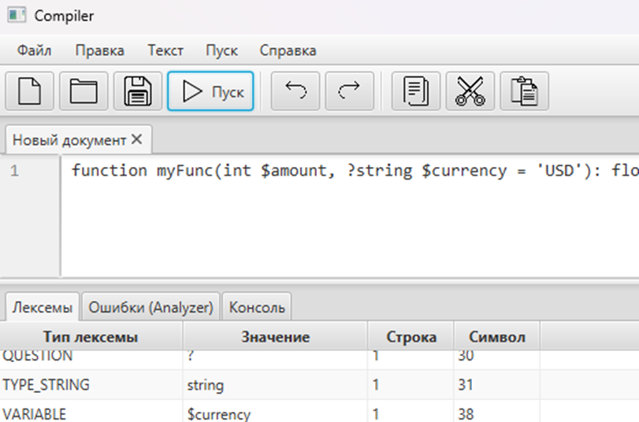

**Пункт "Справка"**
Вызов данного руководства и информации о программе.

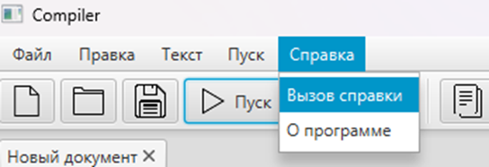

### Панель инструментов
Дублирует основные функции меню для быстрого доступа:
* (а) Создать, (б) Открыть, (в) Сохранить, (г) Пуск, (д) Отмена, (е) Повтор, (ж) Копировать, (з) Вырезать, (и) Вставить.

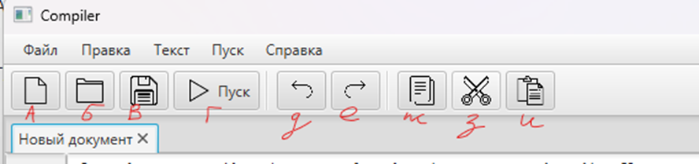

### Дополнительные возможности
1. **Многовкладочность:** Работа с несколькими файлами одновременно.
2. **Drag-and-Drop:** Открытие файлов перетаскиванием в окно редактора.
3. **Нумерация строк:** Отображается слева в окне редактирования.

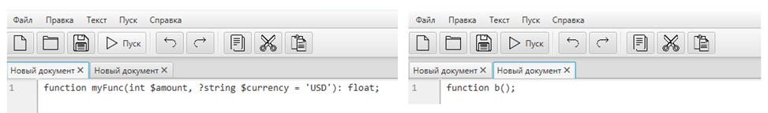
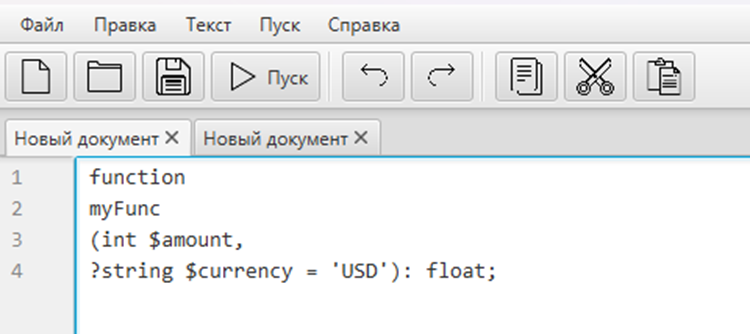